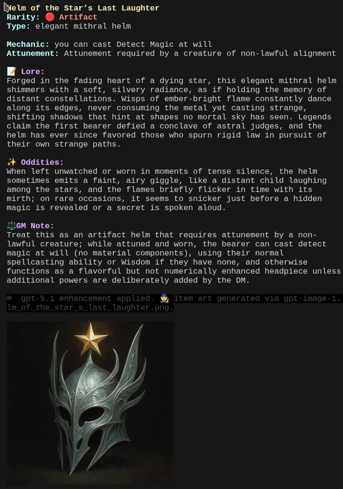

# Arcane Armory – D&D Item Generator

Colorful, terminal-native D&D magic item generators with optional OpenAI-powered lore and inline image support.



> Screenshot: `dnd_item_gen_openai.py` generating an item with GPT‑5.1 lore + GPT‑Image‑1 art rendered via sixel in Tabby.

---

## Contents

- `dnd_item_gen.py` – local-only, fast ANSI item generator
- `data_tables.py` – shared data tables (item types, materials, quirks, etc.)
- `dnd_item_gen_openai.py` – OpenAI‑enhanced generator (GPT‑5.1 + GPT‑Image‑1)
- `images/` – generated item art (PNG files, optionally resized)
- `scn1.png` – example screenshot

---

## 1. Local-only generator

### Run

```bash
cd /files/dndgen
python dnd_item_gen.py
# or, if executable:
./dnd_item_gen.py
```

Features:

- Colorful ANSI output (no network calls).
- Randomly picks:
  - Rarity (Common → Artifact, with emoji)
  - Item type (weapons, armor, rings, wands, boots, tomes, etc.)
  - Materials, qualities, enchantments, origins, quirks
  - Simple mechanical effects and attunement text
- Smooth “card” layout with a short scroll effect.

Use this when:

- You’re offline, or
- You just want quick inspiration without AI calls.

---

## 2. OpenAI‑enhanced generator

### Requirements

- Python environment with:
  - `openai`
  - `Pillow` (optional but recommended, for local image resizing)
- OpenAI API key:
  ```bash
  export OPENAI_API_KEY="sk-..."
  ```

- For inline terminal images:
  - A sixel‑capable terminal (e.g., Tabby with sixel enabled)
  - `img2sixel` installed and in `PATH`
  - Optionally `convert` (ImageMagick) if you want the fallback resize path when Pillow is not available.

### Run

```bash
cd /files/dndgen
python dnd_item_gen_openai.py
# or:
./dnd_item_gen_openai.py
```

What it does:

1. **Base generation (local)**  
   Uses the same tables as `dnd_item_gen.py` to pick:
   - rarity, type, material, quality
   - enchantment, origin, quirk
   - attunement requirement + basic mechanical effect

2. **Lore enhancement (GPT‑5.1)**  
   - Sends the base JSON item to `gpt-5.1`.
   - Gets back:
     - `name` (possibly refined)
     - `enhanced_lore` (2–4 evocative sentences)
     - `enhanced_quirk` (1–2 flavorful quirks)
     - `mechanical_note` (short GM‑facing guidance)
   - Fails gracefully if the API is unavailable or misconfigured.

3. **Image generation (GPT‑Image‑1)**  
   - Builds a short art prompt based on the item’s:
     - name, rarity, type, quality, and material.
   - Calls `gpt-image-1` with `size="1024x1024"`.
   - Receives base64 PNG, saves it under `images/` with a slugged filename.

4. **Image resizing & display**  
   - Resizes the image to a target pixel height (default ~350px):
     - Prefers Pillow (`PIL.Image`).
     - Falls back to `convert` (ImageMagick) if Pillow is unavailable.
   - Displays the resized PNG using `img2sixel` directly after the text card.

If your terminal supports sixel, you’ll see the art appear underneath the item description (similar to the `scn1.png` screenshot).

---

## 3. Environment variables

These can be adjusted without editing the code:

- `OPENAI_API_KEY`  
  Your OpenAI key; required for GPT‑5.1 and GPT‑Image‑1 calls.

- `DNDGEN_NO_INLINE`  
  If set to `1`, `true`, or `yes`, **disables** sixel inline image output:
  ```bash
  export DNDGEN_NO_INLINE=1
  ```

- `DNDGEN_IMG_HEIGHT`  
  Target pixel height for the resized image (when using the OpenAI variant).  
  Default: `350`.

  Example:
  ```bash
  export DNDGEN_IMG_HEIGHT=280
  ```

---

## 4. Troubleshooting

- **Only text, no image**  
  - Check that `img2sixel` is installed and in `PATH`.
  - Ensure your terminal has sixel support enabled.
  - Make sure `DNDGEN_NO_INLINE` is not set (or set to `0`).

- **Image is too big / too small**  
  - Tweak `DNDGEN_IMG_HEIGHT`:
    ```bash
    export DNDGEN_IMG_HEIGHT=250  # smaller
    export DNDGEN_IMG_HEIGHT=400  # bigger
    ```

- **API errors from GPT‑5.1 / GPT‑Image‑1**  
  - Confirm `OPENAI_API_KEY`.
  - Check your OpenAI quota and model availability.
  - The script prints concise error notes in the “GM Note” / enhancement line.

---

## 5. Customization ideas

- Add or rebalance item types in `data_tables.py`  
  (e.g. reduce tomes/spellbooks if you’re seeing too many books in a row).

- Add new:
  - Materials (`MATERIALS`)
  - Qualities (`QUALITIES`)
  - Quirks (`QUIRKS`)
  - Mechanical hooks (`MECHANICAL_EFFECTS`)

- Adjust the prompt in `enhance_with_openai` and `generate_item_image` if you want:
  - Darker / grittier items
  - Cursed artifacts
  - More whimsical fey items
  - NPC wielders or shop blurbs

---

Happy forging. May your tables be ever stocked with strange and shiny loot. 🗡️📜✨
